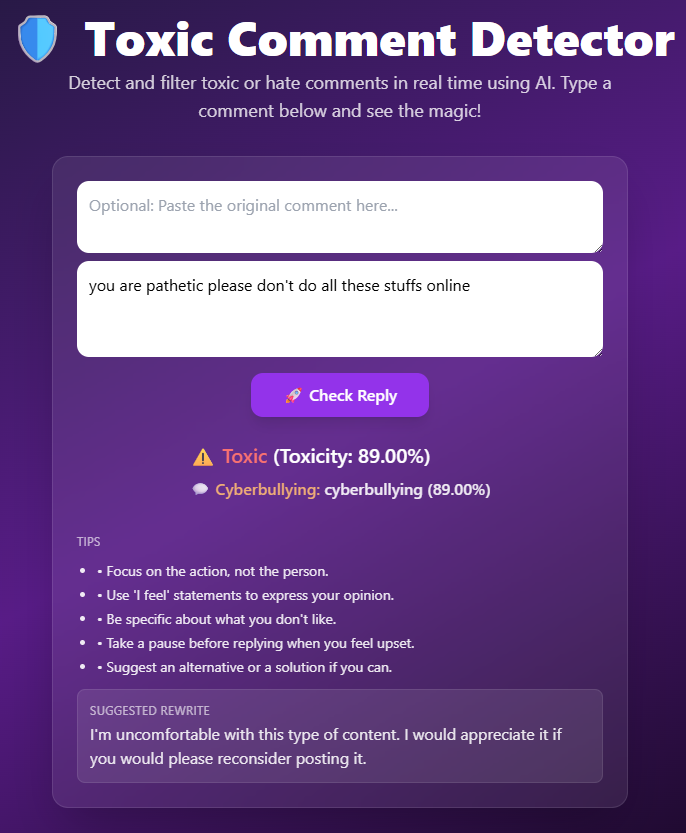
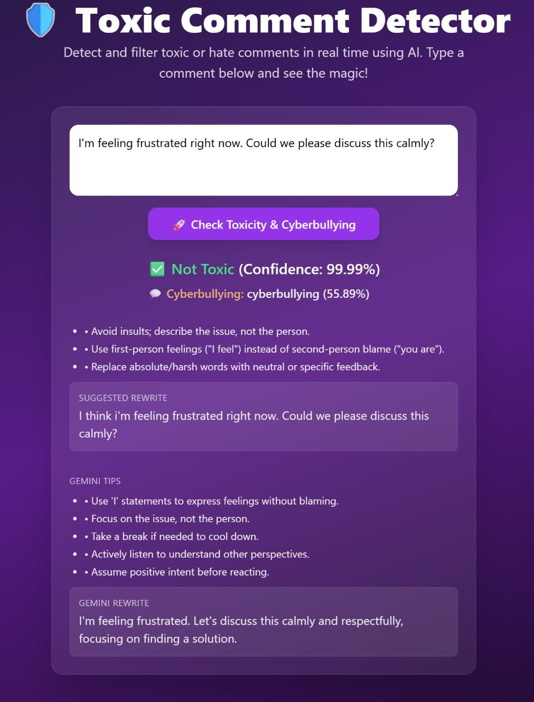
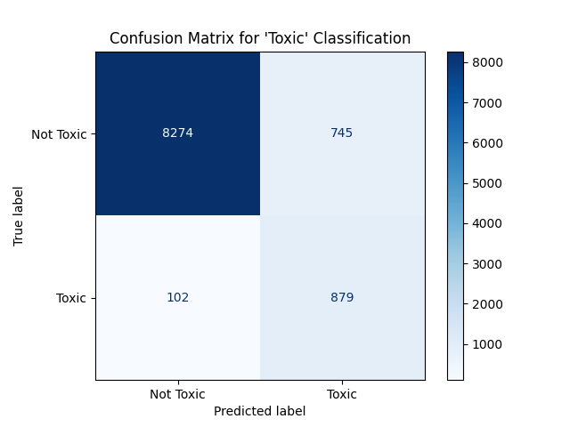
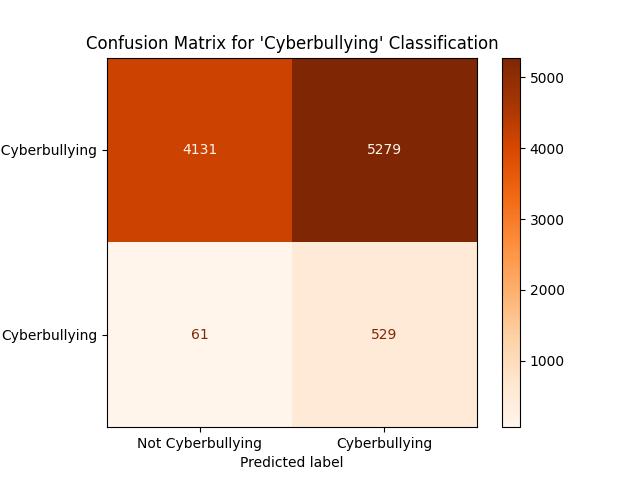
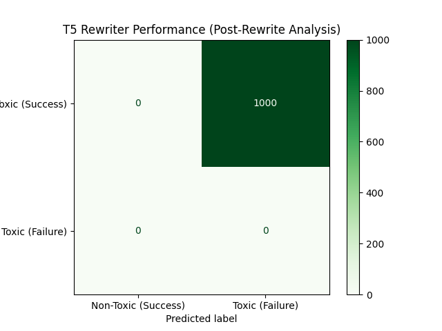

<div align="center">
  <h1>🧠 Toxic Comment Detector & Recommender</h1>
  <p>
    An AI-powered system that detects toxic comments in real-time and suggests polite alternatives.
  </p>
</div>

<a href="https://toxic-comment-detector-updated.onrender.com" target="_blank">
  
</a>
<a href="https://www.python.org/" target="_blank">
  
</a>
<a href="https://flask.palletsprojects.com/" target="_blank">
  
</a>
<a href="https://huggingface.co/transformers" target="_blank">
  
</a>

---

## 🔍 Overview

This project is an end-to-end machine learning application designed to identify and mitigate toxicity in online conversations. It features a robust backend that serves multiple fine-tuned models for real-time analysis and content recommendation.

---

## 🌟 Key Features

-----
-----
-----
*   **Multi-Label Toxicity Detection**: Classifies comments not just as "toxic" but also analyzes them for specific sub-categories like "cyberbullying," "insult," and "threat" using a zero-shot model.
*   **Polite Rewriter (Detoxification)**: Utilizes a fine-tuned T5 model to transform a toxic comment into a more respectful and constructive alternative.
*   **REST API**: A Flask-based backend that exposes the models' capabilities through a simple and effective API.
*   **Comprehensive Evaluation Suite**: Includes scripts to measure the performance of both the detection and rewriting models, generating classification reports and confusion matrices.
*   **Local Model Caching**: Automatically downloads and saves models locally for faster startup times and offline use.

## 🖼️ Screenshots

<div align="center">
  
  
  <p><i>Main application interface for toxicity analysis and recommendations.</i></p>
</div>

---

## 🛠️ Tech Stack

| Layer             | Technology                                 |
|:------------------|:-------------------------------------------|
| **Backend**       | Flask (Python)                             |
| **ML Models**     | BERT, DistilBERT, T5 (via `transformers`)  |
| **ML Framework**  | PyTorch                                    |
| **Data & Eval**   | Pandas, Scikit-learn, Matplotlib           |
| **Deployment**    | Gunicorn, Render                           |

---

## 📊 Model Performance & Evaluation

The models were evaluated on a sampled subset of the Kaggle "Toxic Comment Classification Challenge" dataset.

### 1. Detection Model Performance

#### General Toxicity (`toxic` or `severe_toxic`)
This measures the primary model's ability to identify any form of general toxicity.




#### Cyberbullying (`insult` or `threat`)
This measures the zero-shot model's ability to identify specific cyberbullying behaviors.




### 2. Rewriter Model Performance

The rewriter model was evaluated on its ability to convert a toxic comment into a non-toxic one. The success rate (accuracy) reflects the percentage of successful conversions.




---

## ⚙️ Local Setup and Installation

Follow these steps to run the project locally.

### 1. Prerequisites
- Python 3.10+
- `pip` and `venv`

### 2. Clone the Repository
```bash
git clone https://github.com/Altash8512/Toxic-Comment--Detector.git
cd Toxic-Comment--Detector
```

### 3. Set Up Virtual Environment
```bash
# Create a virtual environment
python -m venv .venv

# Activate it
# On Windows:
.venv\Scripts\activate
# On macOS/Linux:
source .venv/bin/activate
```

### 4. Install Dependencies
```bash
pip install -r requirements.txt
```

### 5. Download & Prepare Models
The application can download models on first run, but it's recommended to prepare them beforehand.

```bash
# Download the detection models
python save_local_model.py
python save_cyber_model.py

# Train the rewriter model (this may take some time)
python train_rewriter.py
```

### 6. Run the Application
```bash
python app.py
```
The server will be available at `http://127.0.0.1:10000`.

---

## 📚 Acknowledgments
-----
-----
- **Hugging Face** for the `transformers` library and model hosting.
- The **Jigsaw/Conversation AI** team for the original dataset.
- **Anthropic** for the helpful-harmless dataset used for rewriter training.
- The open-source community for the powerful tools that made this project possible.

