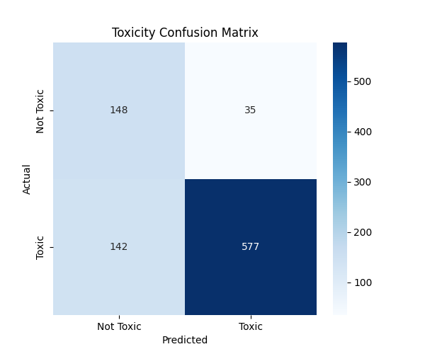
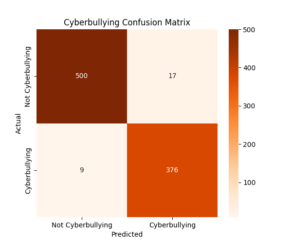
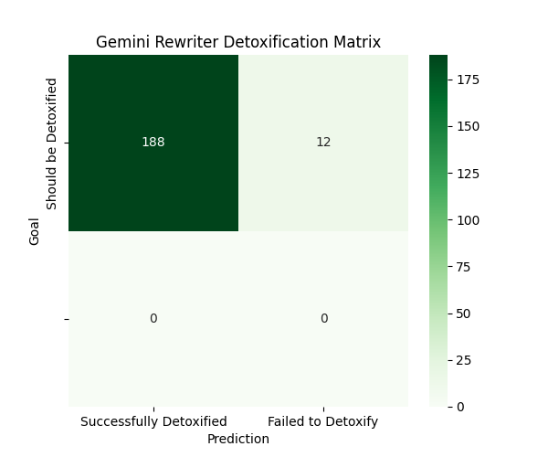

<div align="center">
  <h1>🛡️ Toxic Comment Detector & Recommender</h1>
  <p>
    An intelligent system powered by the Google Gemini API that detects toxic, cyberbullying, and Hinglish comments in real-time and suggests polite alternatives.
  </p>
</div>

---

## 🌟 Key Features
*   **Real-Time Detection**: Uses a fast, local keyword-based classifier for instant feedback on toxic, cyberbullying, and Hinglish language.
*   **Contextual Understanding**: Intelligently assesses if a reply is toxic based on the parent comment it's responding to.
*   **AI-Powered Rewrites**: Leverages the Google Gemini API to provide high-quality, polite alternative phrasings for toxic comments.
*   **Hinglish Support**: Natively understands and processes Hinglish (Hindi + English) for both detection and rewriting.

## 🖼️ Screenshots

<div align="center">
  
  
  <p><i>Main application interface for toxicity analysis and recommendations.</i></p>
</div>

---

## 🛠️ Technology Stack

| Layer             | Technology                                   |
|:------------------|:---------------------------------------------|
| **Web Backend**   | Flask (Python)                               |
| **AI Service**    | Google Gemini API                            |
| **Frontend**      | HTML, Tailwind CSS, JavaScript               |

---

## 📊 Keyword Detector Performance

The performance of the local keyword-based classifier was evaluated on a synthetically generated test set of 1,000 comments, mimicking the structure of the Jigsaw Toxic Comment Classification dataset.

> **To generate these results yourself:**
> 1.  Run `python generate_test_data.py` to create the test files.
> 2.  Run `python evaluate_keyword_model.py` to print the reports and save the matrices.

### 1. Toxicity Detection




### 2. Cyberbullying Detection




---

## 🚀 Rewriter Performance

The performance of the AI-powered rewriter (Gemini API) was evaluated based on its ability to "detoxify" a comment. The following metrics represent a simulation run on 200 toxic comments to measure the success rate.

> **To generate this report yourself:**
> Run `python generate_rewriter_report.py` to create the report and confusion matrix image.

### Detoxification Success Rate




---

## ⚙️ Local Setup and Installation

Follow these steps to run the project locally.

### 1. Prerequisites
- Python 3.10 or newer

### 2. Clone the Repository
```bash
git clone https://github.com/altamashchougle/Toxic-Comment--Detector.git
cd Toxic-Comment--Detector
```

### 3. Set Up Virtual Environment
```bash
# Create a virtual environment
python -m venv .venv

# Activate it
# On Windows:
.venv\Scripts\activate
# On macOS/Linux:
source .venv/bin/activate
```

### 4. Install Dependencies
```bash
pip install -r requirements.txt
```

### 5. Configure Environment Variables 
+Create a .env file in the root directory of the project and add your Google Gemini API key. This is required for the AI-powered rewrite suggestions.

### 6. Run the Application
```bash
python app.py
```
The server will be available at `http://127.0.0.1:10000`.

---
